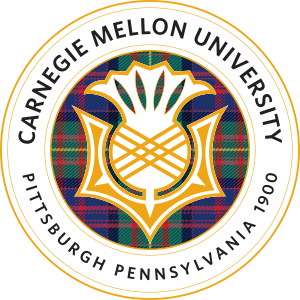
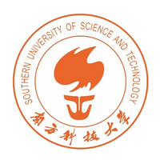
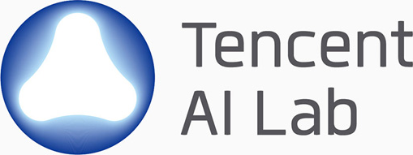

## About Me

Hi there! I'm **Ce Zhang** 👋 I am currently a third-year PhD candidate in the Robotics Institute at Carnegie Mellon University (CMU), with an expected graduation of 2028.

  

    

      
      

        
Ph.D. in Robotics

        <a class="edu-school" href="https://www.cmu.edu/" target="_blank" rel="noopener">Carnegie Mellon University</a>
      

    

    

      
🗓️ 2025 – 2028 (expected)

      
🤝 Advisor: <a href="https://www.cs.cmu.edu/~sycara/" target="_blank" rel="noopener">Prof. Katia Sycara</a>

    

  

  

    

      
      

        
M.Sc. in Machine Learning

        <a class="edu-school" href="https://www.cmu.edu/" target="_blank" rel="noopener">Carnegie Mellon University</a>
      

    

    

      
🗓️ 2023 – 2024

      
🤝 Advisor: <a href="https://www.cs.cmu.edu/~sycara/" target="_blank" rel="noopener">Prof. Katia Sycara</a>

    

  

  

    

      
      

        
B.Eng. in Communication Engineering

        <a class="edu-school" href="https://www.sustech.edu.cn/en/" target="_blank" rel="noopener">SUSTech</a>
      

    

    

      
🗓️ 2019 – 2023

      
🤝 Advisor: <a href="https://www.sustech.edu.cn/en/faculties/zhihaihe.html" target="_blank" rel="noopener">Prof. Zhihai He</a>

    

  

Feel free to <a class="contact-link" href="mailto:cezhang@cs.cmu.edu">reach out</a> if you're interested in my work or would like to discuss potential collaborations!

## Research Interests

I build multi-modal AI systems that are *efficient* and *reliable* enough for real-world use.

Currently working on&nbsp;

My research focuses on:
- How can these models seamlessly interact with humans and their environments—advancing capabilities in long-form/streaming video understanding and spatial reasoning?
- How can we responsibly deploy these models while addressing real-world concerns—mitigating misinformation and hallucinations, and promoting efficiency and safety?

## News

- Jun 2026 Our paper "LENS: Adaptive Spatio-Temporal Zooming for Keyframe Sampling in Long-Form Videos" is accepted to ECCV 2026.
- May 2026 I joined TikTok as a research scientist intern, working on streaming video understanding.
- Feb 2026 Our paper "Evolving Contextual Safety in Multi-Modal Large Language Models via Inference-Time Self-Reflective Memory" is accepted to CVPR 2026.
- Jan 2026 Our paper "pySpatial: Generating 3D Visual Programs for Zero-Shot Spatial Reasoning" is accepted to ICLR 2026.

  Show more
  Show less
  <svg width="12" height="12" viewBox="0 0 16 16" fill="none"><path d="M3 6l5 5 5-5" stroke="currentColor" stroke-width="2" stroke-linecap="round" stroke-linejoin="round"/></svg>

<ul>
<li>Jan 2026 Our paper "VScan: Rethinking Visual Token Reduction for Efficient Large Vision-Language Models" is accepted to TMLR.</li>
<li>Mar 2025 I will be joining the Ph.D. in Robotics program at Carnegie Mellon University (CMU) in Fall 2025.</li>
<li>Jan 2025 Our paper "Self-Correcting Decoding with Generative Feedback for Mitigating Hallucinations in Large Vision-Language Models" is accepted to ICLR 2025.</li>
</ul>



## Experiences

  

    
    

      

        
Research Scientist Intern

        
TikTok

        

          📍 San Jose, CA, USA
          🗓️ May – Aug 2026
          🤝 Mentor: Ming Zhou
        

      

      
    

  

  

    
    

      

        
Research Intern

        
Tencent AI Lab

        

          📍 Shenzhen, China
          🗓️ Feb – Jul 2025
          🤝 Mentor: <a href="https://mayer123.github.io/" target="_blank" rel="noopener">Dr. Kaixin Ma</a>
        

      

      
    

  




